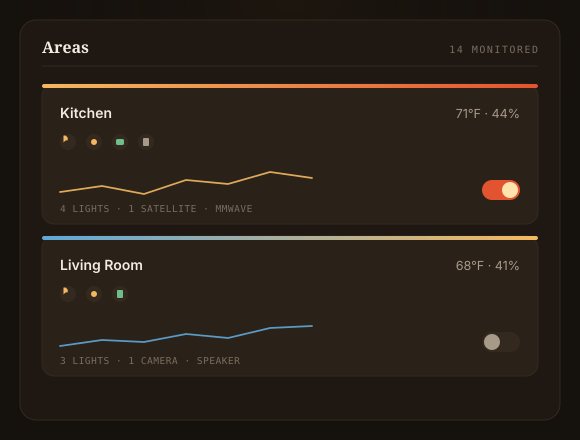
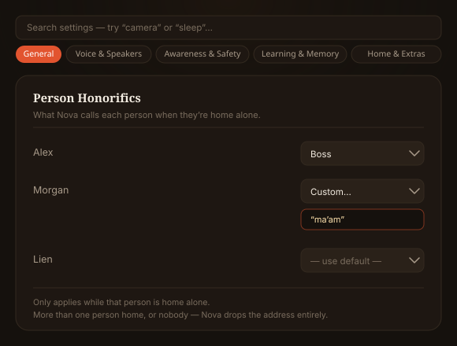

<div align="center">

# Nova AI Assistant

An autonomous AI butler for Home Assistant: voice, vision, and a reasoning core that learns your home and watches over it.


[](https://github.com/abz2much/NOVA)
[](https://github.com/abz2much/NOVA/releases)
[](LICENSE)

</div>

---

Nova installs as a Home Assistant custom integration through HACS and runs entirely inside HA, with no separate container and no cloud account required to start. Nova starts conservative and tells you what it notices, but it isn't observation-only: it can control your home directly when you ask it to. What stays deliberately gated is autonomy and trust — a suggested automation is never installed without your explicit approval, sensitive actions (unlocking, opening a garage) keep a confirmation step, and Nova reports honestly what it actually knows: a physically confirmed ("verified") outcome is never worded the same as a command it merely sent and accepted.

> **Active development.** Nova is a solo-maintained project under heavy, ongoing change — expect frequent releases, including breaking changes between versions, while things settle. It's genuinely usable today, but not a "set it up once and forget it" integration yet. Check `CHANGELOG.md` before updating if you want to know what changed.

## Quick start (5 minutes, no cameras required)

Nova looks elaborate, but the floor is low. You can be talking to it in five minutes with nothing but Home Assistant and either a supported cloud-provider API key or a local Ollama endpoint. Cameras, voice hardware, and local GPU inference are all optional upgrades you add later.

1. **Install via HACS.** Add this repo (badge below), install "Nova AI Assistant," restart Home Assistant.
2. **Add the integration.** Go to *Settings → Devices & Services → Add Integration → Nova*. Paste a cloud API key from [Groq](https://console.groq.com), Anthropic, OpenAI, or Gemini; Nova detects which provider it belongs to from the key itself, no picker needed. Or leave it blank and point it at a local Ollama URL to run with no cloud account at all.
3. **That's it.** Nova registers its conversation agent and appears in your sidebar. Ask it about your home, your calendar, or the outside world.

Everything past this point (vision, doorbell analysis, the live 3D floor plan, proactive safety) layers on top as you connect cameras and voice. None of it is required to start. Jump to [Installation](#installation) for the full walkthrough.

## What it does

### Voice and conversation

A pluggable LLM brain (Groq, Gemini, OpenAI, Anthropic, or a local Ollama server) drives natural conversation through the Home Assistant voice pipeline. When Nova bootstraps the voice stack itself (HA OS/Supervised), it installs a custom Nova Piper voice as the default. Piper is optional, not required: flip on "use Home Assistant's configured TTS voice" and Nova speaks through whichever HA TTS provider you've set up instead — Fish Audio, ElevenLabs, Home Assistant Cloud, or anything else exposed as a `tts.*` entity. Nova's own Piper voice-quality setting is only ever applied when Piper is the entity actually in use; it's never injected into another provider's request. Works with ESP32-S3 satellites, Wyoming, and Google speakers.

### Web research and schedule awareness

Ask about the outside world: current events, facts, "what's the latest on…" and Nova looks it up. DuckDuckGo works out of the box with no key, or point it at a self-hosted SearXNG. It also reads your `calendar.*` entities, surfacing upcoming events and flagging conflicts such as overlaps and tight back-to-back transitions.

### Answers from your own paperwork

Drop appliance manuals and receipts (PDF, `.txt`, `.md`) into `/config/nova/documents`, then ask "what's the filter size for the furnace?" or "when did we buy the dishwasher?" Nova answers from your documents and cites the source. Retrieval is keyword-based out of the box; with Ollama running, flip on semantic search for meaning-based matching, nothing extra to install.

### The Nova voice

Nova's persona is inspired by Stark's JARVIS: dry, precise, unflappable, and quietly witty, but strictly situational about it. The wit stays out of the way the moment something is wrong; Nova does not joke during a smoke alarm. A banter level setting (plain / dry / full) tunes how much character surfaces, and urgent or grave events always speak plainly no matter what that setting is.

### Vision and cameras

Automatic doorbell-press analysis using a two-pass live-clip and recorded-event approach, package and mail detection on porch cameras, and silent visitor learning that quietly builds a picture of who comes and goes. Nest and Frigate feeds are reasoned over with vision models; a Eufy Security doorbell instead drives this natively off its own on-device sensors (ringing, stranger-vs-known-face, package delivered/stranded/taken) with no vision call needed for the routine cases — only an actual stranger triggers one.

### The Cognitive Core

A reasoning loop that classifies every household event by urgency and decides whether it's worth your attention. It grounds decisions in your home's actual history ("the kitchen light at 7am is routine; the basement window has never opened before"), escalates security-relevant events when you're away, and proposes automations from patterns it observes.

### Current intelligence and observability

Nova is built to show its work rather than ask for blind trust:

- **Decisions browser** (Logs → Decisions): every proactive decision, with the evidence and confidence behind it, the model that made the call, and Helpful/Unnecessary/Wrong feedback.
- **Decision Lab**: replay a past decision against your *current* settings to see whether it would pass today's confidence threshold — a policy check, not a reconstruction of what actually happened.
- **Setup Doctor**: a read-only health check across entity references, room speakers, camera overrides, the notification service, and more, each with a plain-language fix — never applied automatically.
- **Installed Automations** (Suggestions tab): tracks whether an automation Nova proposed actually *runs* once installed, separately from whether it was accepted, plus your own Working/Needs adjustment feedback.
- **Provider Activity**: bounded daily aggregates of LLM calls (provider, model, role, token/latency counts) — never the prompts, responses, tool arguments, images, or credentials behind them.
- **Spoken History** (Logs → Spoken History): the last 100 confirmed announcements Nova actually delivered, each repeatable from the panel or by asking "what did you just say."
- **Conversation memory that knows whose it is**: continuity is scoped to the person speaking, with the shared conversation itself still available as context, and irrelevant ambient speech (background chatter, TV dialogue) is rejected before it can ever be written into that memory.
- **Honest device control**: an ambiguous device name gets a clarifying question instead of Nova silently guessing the closest match, and a command's result is reported as verified, accepted, unverified, or failed — Nova never claims a lock is locked or a light is on before it's actually confirmed that.

### The Local Mind

When the cloud is unreachable, Nova doesn't go dumb. An offline reasoning brain judges household events locally — self-awareness (is this sensor flapping?), historical grounding against `patterns.db`, case-based memory from cached past decisions, situational judgment, and persona-voiced phrasing — so routine events keep getting sound, well-spoken calls with no internet at all. Deterministic voice/text commands (turn on a light, lock a door, ask what's open) also run entirely locally, with no LLM call either way. What the Local Mind does *not* replicate is open-ended reasoning about a genuinely novel situation, web research, or vision analysis — those still need a configured cloud or local-GPU provider when the moment calls for them.

### Safety and security

Proactive monitoring for freezing pipes, smoke, CO, water, unauthorized entry, and nighttime lockdown. Enforcement is occupancy-gated, so it only kicks in when it should.

### The dashboard

**Command Center**: a warm ember/gold "stellar core" centerpiece — an animated particle core whose state (idle, reasoning, asleep) reflects what Nova is actually doing, so the dashboard looks and feels the same whether you have zero cameras or twelve. Areas show live capability icons, temperature/humidity sparklines, and a light toggle per room; Settings is reorganized around what you're doing rather than which subsystem it touches, right down to a per-person "who does Nova call whom" card. A Residence tab gives you a live, rotatable 3D house view built from the same floor plan you edit in Settings, plus an event feed and a doorbell-training view. The Logs tab has three subviews — **System Log**, **Decisions**, and **Spoken History** — and the diagnostics card holds **Setup Doctor** and **Provider Activity**; **Installed Automations** lives in the Suggestions tab, next to the automations Nova is still proposing.

<div align="center">
<table border="0">
<tr>
<td width="50%"></td>
<td width="50%"></td>
</tr>
<tr>
<td align="center"><em>Every monitored room, its live capability icons, a temperature/humidity trend, and a one-tap light toggle.</em></td>
<td align="center"><em>Settings reorganized by task, not subsystem — down to what Nova calls each person when they're home alone.</em></td>
</tr>
</table>

<sub>Visuals reflect the panel's actual design system. The live dashboard renders in your browser inside Home Assistant.</sub>
</div>

## Full capability reference

Everything Nova can do today, grouped by domain. In conversation these surface as tools the agent invokes on its own; most also have a panel control.

**Conversation and delegation**
- Natural voice and text conversation through the Home Assistant pipeline, in a dry, MCU-JARVIS-inspired persona with a tunable banter level.
- Ephemeral sub-agents (`delegate_task`): for a complex, self-contained slice of a request, Nova spins up a focused in-process sub-agent with a minimal objective, a curated read-only tool subset, and a small turn budget, then folds the result back. Sub-agents can't actuate or recurse, and depth is capped. On a single-GPU host they run serially, so the benefit is a tight, focused context rather than parallelism.
- HOMER — Nova's single, canonical read-only diagnostic specialist, a named `delegate_task` profile (`profile: "homer"`; `capability: "diagnostics"` is kept working as an alias for the same profile, not a second implementation). For a fault ("why is this device unavailable", "why did this automation fail", "is the host running out of memory", "check Nova's connectivity and system health"), Nova can hand the question to HOMER instead of guessing: it investigates with a fixed set of diagnostic and state-reading tools only (system health, cognitive-core status, connectivity, energy status, activity history, entity state/search, root-cause analysis), separates what it observed from what it inferred, and reports a likely cause, its confidence, and a recommended next step back to Nova — it never addresses a device directly and never claims to have fixed anything. It has no device-control, configuration, memory-writing, or delegation tool, capped at 4 tool turns, and — like every sub-agent — can't delegate further. Always available; nothing to turn on.
- Five specialist bridge tools (`ask_executive_assistant`, `ask_marketing_agent`, `ask_security_privacy_agent`, `ask_homelab_infra_agent`, `ask_house_manager_agent`) hand off to separate n8n-orchestrated agents over a private webhook. These need their own n8n setup to work and aren't something a fresh install has access to out of the box.

**Devices, scenes and home state**
- Control one device or many at once, run scenes and scripts, and execute multi-step plans (`control_device`, `bulk_control`, `run_scene_or_script`, `execute_plan`). An ambiguous name ("turn off the light" with three candidates) gets a clarifying question instead of Nova silently picking the closest match, and Home Assistant merely *accepting* a command is never reported the same way as Nova actually *confirming* it took effect.
- Query live state, search entities, list a room's devices, and summarize the whole home (`get_entity_state`, `search_entities`, `get_area_devices`, `get_home_summary`).
- Read Home Assistant's recorded history and logbook to answer "what happened while I was out" (`activity_history`).

**Schedule and communications**
- Read household `calendar.*` entities, surface upcoming events, and flag overlaps and tight back-to-back transitions (`calendar_agenda`).
- Read-only email (`read_email`): checks the inbox over IMAP, read-only by construction (opens with EXAMINE, fetches with BODY.PEEK, never marks, moves, or deletes). Fetched mail is sanitized and treated as untrusted. The password lives in `secrets.yaml`.
- Scheduled morning and evening briefings covering weather, calendar, overnight events, energy, and active hazards, occupancy-gated.

**Web and your documents**
- Look up the outside world (`web_research`) using DuckDuckGo out of the box, or a self-hosted SearXNG.
- Answer from your own manuals and receipts (`search_documents`, `ingest_documents`), keyword-based out of the box or Ollama-embedded semantic search.

**Cameras and vision**
- Look at a camera on demand and describe it (`look_at_camera`); report who's recognized at the door (`who_do_you_see`).
- Automatic doorbell-press analysis, package and mail detection, and silent visitor learning — over Nest/Frigate vision, or natively off a Eufy Security doorbell's own sensors.

**Awareness, diagnostics and energy**
- Report the cognitive core's state, connectivity, and a full self-diagnostic (`cognitive_status`, `connectivity_status`, `system_diagnostics`); reason about the root cause of a fault (`root_cause`).
- Whole-home energy: current draw, peak awareness, and load advice with tunable agency (`energy_status`).

**Weather and hazards**
- Local forecast (`weather_forecast`) and a live multi-hazard report covering nearby earthquakes (USGS), severe weather (NWS), and disasters (NASA EONET) (`hazard_report`).

**Safety and security**
- Proactive monitoring for freezing pipes, smoke, CO, water, unauthorized entry, and nighttime lockdown, occupancy-gated so enforcement only happens when it should.
- Confirm or dismiss intrusion events and acknowledge alerts by voice (`dismiss_intrusion`, `acknowledge_alert`); optional voice confirmation before sensitive actions like unlocking.

**Modes, memory, goals and suggestions**
- Set operational modes, including custom ones (`set_mode`), and tune how much Nova acts on its own (`manage_autonomy`).
- Remember facts you tell it (`remember`), curated in the panel's Memory tab and confirmed with you before it's trusted; open and track standing goals (`create_goal`, `update_goal`, `manage_goals`) and schedule follow-ups (`schedule_followup`, `manage_followups`).
- Conversation continuity is scoped to the person speaking rather than searched globally, while the current conversation itself still carries shared household context — nobody's private recall becomes everyone's, but the room you're standing in isn't a stranger to Nova either.
- Spoken History (Logs tab) keeps the last 100 confirmed announcements Nova actually delivered, replayable from the panel or by asking Nova to repeat itself.
- Review, approve, or dismiss the automations it proposes from observed patterns (`review_suggestions`, `approve_suggestion`, `dismiss_suggestion`).
- Mute a noisy entity from awareness, or bring it back (`ignore_entity`, `unignore_entity`); read opt-in wearable and wellbeing context (`wellbeing_context`).

**Resilience and privacy**
- The Local Mind replicates the full decision procedure offline, so Nova stays useful with no internet at all.
- All LLM credentials live in Home Assistant's `secrets.yaml`, never in plaintext panel config. Any existing plaintext keys are relocated automatically and safely (verify-before-strip) on upgrade.
- A single config resolver acts as the one source of truth for which model each part of Nova runs on.

## Requirements

To start, you need exactly two things:

- **Home Assistant** with [HACS](https://hacs.xyz) installed.
- **Either a supported cloud-provider API key or a compatible local Ollama/custom endpoint.** [Groq](https://console.groq.com), Anthropic, OpenAI, and Gemini are all supported cloud options, or point Nova at a local Ollama server and run with no cloud account at all.

Optional add-ons unlock more, but none are required to begin:

- *Voice*: HA OS / Supervised is recommended; Nova auto-installs the Piper, Whisper, and openWakeWord voice stack through the Supervisor. On Container/Core you'd add those yourself.
- *Vision*: a Gemini API key for camera reasoning, plus cameras. Any HA camera works, but Frigate is the recommended backbone for detection and snapshots, and Nest cameras and doorbells are supported through it. A Eufy Security doorbell needs neither — it's detected natively, no plumbing required.
- *Voice hardware*: ESP32-S3 satellites and a Piper TTS voice.
- *Fully local inference*: a GPU box running Ollama. Point `llm_base_url` at it and Nova runs entirely on your own hardware, with no cloud account.

## Installation

**1. Add this repository to HACS.**

[](https://my.home-assistant.io/redirect/hacs_repository/?owner=abz2much&repository=NOVA&category=Integration)

Click the badge above, or do it manually: in **HACS → ⋮ (top right) → Custom repositories**, add the URL below with category **Integration**.

```
https://github.com/abz2much/NOVA
```

**2. Install "Nova AI Assistant"** from HACS, then restart Home Assistant.

**3. Add the integration.** Go to **Settings → Devices & Services → Add Integration → Nova**. Enter a cloud API key from Groq, Anthropic, OpenAI, or Gemini; Nova detects the provider from the key's own shape, so there's no separate picker. Or leave it blank and enter a local LLM URL (for example `http://homeassistant.local:11434/v1`) to run Ollama with no cloud account. Nova registers its conversation agent and appears in the sidebar.

**4. Set up voice (optional).** On Home Assistant OS / Supervised, Nova bootstraps the voice stack itself on first run: it installs and starts the Piper, Whisper, and openWakeWord add-ons, downloads the Nova voice, and creates an Assist pipeline with Nova as the conversation agent. On Container/Core installs, with no Supervisor, install those pieces yourself and create the pipeline through Settings → Voice Assistants.

**5. Fine-tune (optional).** Advanced routing, observer mode, camera watching, and the AI-model-per-role assignments are all configured from the Nova panel under **Settings**.

> **Hard-refresh after updates.** The dashboard JavaScript is cached aggressively; after upgrading, refresh with `Ctrl+Shift+R` so the new panel loads.

## Advanced setup: cameras and continuous streaming

Everything in this section is optional. You only need it for the vision features (doorbell analysis, package detection, the HUD's live camera tiles). Skip it if you're starting with voice and reasoning and come back when you want cameras.

### How Nova uses cameras

Nova doesn't require any specific camera brand. It works with any camera Home Assistant exposes as a `camera.*` entity, pulling stills through the standard image API. But it's built to lean on [Frigate](https://frigate.video) as the backbone, and that's the recommended setup.

Frigate is the funnel: its on-camera object detection for people and packages, fired over MQTT, is far more reliable than a vision model guessing at a raw feed, and its event snapshots are high-resolution and cropped to the detection. Nova listens to `frigate/events`, consumes those snapshots directly, and its face recognition reads Frigate's `tracked_object_update` and `last_recognized_face` channels. If you run cameras at all, routing them through Frigate is what makes the vision features sharp.

Nest is a supported source, not a requirement. Nova can consume Nest cameras and doorbells too, but Google's cameras need extra plumbing (below) because of how their stream API behaves. If you have Nest gear, route it into Frigate through go2rtc and you get the best of both: Nest's doorbell events plus Frigate's detection and durable frames.

Eufy Security is also a supported source, and needs *no* extra plumbing at all. If the [eufy_security HACS integration](https://github.com/fuatakgun/eufy_security) is set up, Nova auto-detects each Eufy camera/doorbell and drives doorbell press, stranger-vs-known-face, and package detection off its own native sensors directly — no Frigate, no go2rtc, no vision-LLM call for the routine cases (a known face, a normal delivery). Discovery is by the device's unique_id, so renaming it in HA never breaks it.

Any other camera, generic RTSP, local ONVIF, and so on, works through the standard snapshot path with no special setup. Add it to Frigate for detection, or let Nova pull stills directly.

The rest of this section is Nest-specific. If you don't use Nest, skip it entirely: Eufy needs nothing below, and everything else just needs Frigate pointed at your cameras.

### Eufy Security cameras (only if you use Eufy)

Install the [eufy_security integration](https://github.com/fuatakgun/eufy_security) via HACS, add it in **Settings → Devices & Services**, and sign in with your Eufy account. That's the entire setup — Nova needs no configuration of its own. On the next Nova reload it discovers every Eufy camera automatically and starts watching its `ringing`, `stranger_person_detected`, `person_detected`, `motion_detection_type_vehicle`, `pet_detected`, and `package_delivered`/`package_stranded`/`package_taken` sensors directly — all of it native, at zero vision-LLM cost for routine detections.

A camera added to Eufy *after* Nova has already started needs a Nova reload (not a full HA restart) to be picked up — same as every other camera-discovery path in the integration.

### Nest cameras (only if you use Nest)

Nova consumes Nest cameras and doorbells through the official [Google Nest integration](https://www.home-assistant.io/integrations/nest/). It does not, and legally cannot, talk to Google's Smart Device Management API with its own credentials, because Google binds SDM access to your Google account and Device Access project. One-time setup:

1. **Google SDM API.** Create a project in the [Device Access Console](https://console.nest.google.com/device-access) (US $5 one-time fee) and a Google Cloud project with the SDM API enabled and OAuth credentials.
2. **Credentials in HA.** Add your OAuth Client ID and Secret under *Settings → Devices & Services → Application Credentials*, then add the Google Nest integration and authorize it. Your cameras and doorbell appear as `camera.*` entities.
3. **That's it for Nova.** It auto-detects Nest-platform cameras and uses the right frame source for each event (event media, stream-wake, or its own snapshot path). Battery/WebRTC-only Nest cameras can't produce ordinary still images while idle; the Nova panel handles this by escalating to its own snapshot tier automatically, so the tile shows frames instead of going blank.

### Continuous streaming for Nest cameras (recommended if you use Nest)

Google's SDM API hands out WebRTC/RTSP stream URLs that expire roughly every five minutes and won't reliably produce a still image while a camera is idle. That's fine for the occasional glance, but it means live tiles can stall and 24/7 NVR recording (Frigate) chokes.

The durable fix, and the one Nova is built to lean on, is restreaming each Nest camera through [go2rtc](https://github.com/AlexxIT/go2rtc), which speaks Google's SDM protocol natively, renews the expiring stream transparently, and republishes a solid RTSP/WebRTC feed that Home Assistant, Frigate, and Nova all consume like any local camera. If you already run Frigate, you already have a go2rtc instance bundled with it, which is the other reason Frigate is the recommended backbone: it does double duty as both your detector and your Nest restreamer.

**1. Point go2rtc at your Nest account.** In your go2rtc (or Frigate) config, add a `nest:` source per camera. You need five values, all from the same Device Access setup above:

```yaml
go2rtc:
  streams:
    bedroom2_restream:
      - "nest:?client_id=CLIENT_ID&client_secret=CLIENT_SECRET&refresh_token=REFRESH_TOKEN&project_id=DEVICE_ACCESS_PROJECT_ID&device_id=DEVICE_ID"
    front_doorbell_restream:
      - "nest:?client_id=CLIENT_ID&client_secret=CLIENT_SECRET&refresh_token=REFRESH_TOKEN&project_id=DEVICE_ACCESS_PROJECT_ID&device_id=DOORBELL_DEVICE_ID"
```

- `client_id` / `client_secret`: the same OAuth pair you added under Application Credentials.
- `project_id`: the Device Access Console project UUID (not the Google Cloud project).
- `refresh_token`: from the Nest integration's stored config. In *Settings → Add-ons → File editor* (or SSH), open `.storage/core.config_entries`, find the `nest` entry, and copy its `refresh_token`.
- `device_id`: easiest through the go2rtc web UI (Frigate exposes it on port `1984`). Choose Add → nest, supply the other four values, and it lists your devices with their IDs. Copy the one you want.

**2. (Optional) add the restreams as Frigate cameras.** If you want continuous recording and object detection, add each `*_restream` as a Frigate camera and enable `detect`/`record`. Frigate's on-camera object detection for people and packages is more reliable than vision-LLM guessing, and Nova will happily consume Frigate's snapshots.

**3. Tell Nova to source frames from the twins.** Restart Home Assistant so the new `camera.*_restream` entities exist, then map each Nest camera to its restream in Nova's config (`camera_overrides`). The Nest entity keeps its identity (chips, names, doorbell events), while every frame comes from the durable restream:

```json
{
  "camera_overrides": {
    "camera.bedroom2_camera": "camera.bedroom2_restream",
    "camera.front_doorbell": "camera.front_doorbell_restream"
  }
}
```

This lives in `/config/nova/config.json`; merge it into the existing object rather than replacing the file. Nova validates this on load, so a typo is sidelined with a notification rather than breaking the panel. Then open **Camera Watch → DIAG** on the camera. It should report `override → camera.bedroom2_restream` and a healthy full-size frame instead of a blank or black tile.

> **Note:** go2rtc's Nest source is a third-party bridge, and Google occasionally changes its auth behavior. If a restream ever drops, Nova falls back to the original Nest entity automatically; worst case is the pre-restream behavior, never worse.

## Configuration highlights

| Setting | What it does |
| --- | --- |
| `llm_provider` / per-role models | Choose Groq, Gemini, OpenAI, Anthropic, Ollama, or custom, independently for the main agent, classifier, reasoning, review, vision, and camera-reasoning roles. Each role shows only providers with a credential (or, for custom/Ollama, a saved endpoint) configured. A saved model missing from live discovery is kept, never silently replaced. |
| `llm_base_url` | Point the Ollama/custom providers at your local GPU server (for example `http://gpu-server:11434/v1`). |
| Provider credentials | Settings → AI Models (or Configure → Credentials) — one dedicated key per provider, stored only in `secrets.yaml`. Each role above uses only its own provider's key, never another's. |
| `observer_enabled` | Let Nova watch the event stream and decide what's worth surfacing. |
| `rich_reasoning` | Cloud-first judgment for medium/high-urgency events: costs a bit more, reasons better. |
| `visitor_learning` | Silently learn from person events at the door. Never spoken. |
| `package_detection` | Watch porch cameras for packages and mail. |
| `cognition_threshold` | How salient an event must be before Nova escalates it. |
| `camera_event_learning` | Settings → Learning & Memory → Routine Learning. Feed Eufy/Frigate/Nest/vision detections into pattern learning. On by default; off automatically whenever Nova's learning system itself is off. |
| `camera_event_confidence_floor` / `camera_event_dedup_window` | Minimum source-supplied confidence (0–100, floor of 0 disables filtering) and the cross-source deduplication window in seconds (default 300) for camera-event learning. |
| `camera_historical_awareness` / `camera_awareness_min_observations` | Add repeated historical camera patterns to interactive conversation prompts, with a separate opt-out and a minimum evidence threshold from 3 to 12 observations across more than one day. Inactive whenever master learning or camera-event learning is off. |

## Languages

Nova follows your Home Assistant language automatically, and you can override it under **Settings → General → Language** (or leave it on Auto). The setup and configuration dialogs are localized through Home Assistant's own translation system; the in-panel HUD is localized by Nova. Anything not yet translated falls back cleanly to English, so nothing breaks.

**Panel UI:** complete for all 18 supported languages: Czech, Danish, Dutch, Finnish, French, German, Italian, Norwegian Bokmål, Polish, Portuguese, Brazilian Portuguese, Romanian, Russian, Slovak, Spanish, Swedish, Turkish, and Ukrainian (English is the source language, built in).

**Setup dialog:** complete for French, German, Spanish, Italian, Portuguese, and Dutch. Other languages fall back to English here; this is Home Assistant's own translation layer, separate from the panel.

### Help translate

Translations are plain JSON files; no code required.

- **Panel UI:** `custom_components/nova/frontend/i18n/<lang>.json`, keyed by the exact English string.
- **Setup dialog:** `custom_components/nova/translations/<lang>.json` (Home Assistant's format).

To add a language or refine an existing one, copy an existing file, translate the values, and keep the keys and technical tokens (entity IDs, model names, URLs) unchanged. Corrections are welcome, especially native-speaker fixes to machine-assisted translations. Right-to-left languages (Arabic, Hebrew, and so on) also need panel layout support, so that's a good area to help with if you're interested.

## Architecture

Nova is a Home Assistant custom integration (domain `nova`) installed through HACS into `custom_components/nova/`. It runs in-process: it registers the conversation agent and voice pipeline and serves the custom dashboard panel directly. State and learned behavior persist under Home Assistant's own reported configuration directory — typically `/config/nova/` — mostly as local SQLite: `patterns.db` (state-change/command history behind proposed automations and historical grounding), `conversations.db` (conversation history and Spoken History together), `decisions.db` (the Decisions browser's evidence/confidence/outcome records), and `knowledge.db` (curated facts from `remember`). That's not an exhaustive list of everything under the directory — the doorbell-training dataset, lockdown state, and the reasoning cache live there too, among other files. One exception: Nova's semantic-memory database, `nova.db`, currently lives at the configuration root itself (typically `/config/nova.db`), not inside the `nova/` subdirectory.

The reasoning pipeline is layered for resilience and cost: local templates, then a learned cache, then cloud (or eventually a local model), with the Local Mind offline brain as the floor beneath everything. A connectivity breaker guards cloud calls, and every local decision logs its reasoning chain to the dashboard's log view.

## Privacy and your data

Nova is local-first. Everything it learns and stores lives inside your Home Assistant instance, mostly under `/config/nova/`. There is no Nova cloud and no telemetry — nothing is ever sent anywhere on Nova's own initiative.

What's stored, and where:

- **Learned behavior and patterns:** `patterns.db` (state changes and commands used to propose automations), `person_patterns` (per-person routines), and the reasoning cache. All local SQLite. Meaningful camera detections (Eufy, Frigate, Nest, or Nova's own vision analysis) feed the same table as a bounded, structured row — canonical label, camera/area, source, a confidence number only when the source supplied one, a resident name only when Nova's recognition cache has a fresh, confident match for that camera — never an image, face embedding, raw provider payload, or raw vision-model response.
- **Knowledge and memory:** the curated `knowledge.db`, conversation history, and vector/FTS conversation memory — scoped to the right conversation or person rather than searched globally. All local SQLite, editable and erasable from the dashboard.
- **Decisions and activity:** `decisions.db` (the Decisions browser's evidence, confidence, and outcome feedback) and bounded Provider Activity aggregates — call counts, model, token/latency numbers — which never include the prompts, responses, tool arguments, images, or credentials behind a call.
- **Documents:** anything you drop in `/config/nova/documents` for the RAG agent, plus its index and vectors. Ingestion is path-guarded so it only ever reads inside that folder.
- **Camera and vision:** snapshots analyzed on demand aren't retained. Confirmed-intrusion snapshots are the one exception (last 40, for the panel's review/labeling history) — stored privately under `/config/nova/`, never in a web-servable location, and delivered to the panel only over its own authenticated connection. A push notification's photo is a short-lived, cryptographically signed copy that expires and deletes itself. Recording is Frigate's job, under your control.
- **Biometrics:** off by default and opt-in. When enabled, Nova reads wearable entities Home Assistant already exposes for comfort context (being quieter when a sleep sensor says you're resting, for example). This context only ever reaches the model when you're running a local Ollama provider — with a cloud provider configured (Groq, OpenAI, Anthropic, Gemini) it's withheld entirely, so heart-rate/sleep readings never leave your network. It is explicitly not medical: it never diagnoses, alarms on, or clinically interprets a reading, and anything concerning is left to your own device or a medical professional.

What leaves your network is only what the features you actually enable need: your configured LLM and vision providers, whichever HA TTS provider you've chosen if it isn't the local Piper voice, and — only if you turn them on — web research (DuckDuckGo or your own SearXNG), read-only email over IMAP, hazard feeds (USGS/NWS/EONET), and the optional n8n specialist-agent bridges, each reached only when the feature that needs it runs. Run everything through Ollama and a purely local TTS voice, and the pipeline stays entirely on your own network. Sensitive integration credentials are held by Home Assistant, not Nova.

## What's different from upstream

Nova began as a fork of [jarvis-aio](https://github.com/sam3gp8/jarvis-aio), and the two projects still share their original structure. Nova is now maintained as an independent fork and no longer tracks Jarvis release for release. Most shared backend modules have changed, Nova has its own features, interface, security controls, and Home Assistant lifecycle behaviour, and fixes added to either project do not automatically exist in the other.

The list below covers Nova-specific differences. It is not a complete release-by-release comparison; see each project's changelog for that.

**Security hardening**
- Voice commands can lock a door instantly, but can never unlock one or open a garage — that always requires a tap on your phone, so a spoofed or deepfaked voice can't grant physical access on its own.
- Nova uses one explicit household alarm for security decisions instead of trusting every alarm-shaped entity exposed by camera hubs and vendor bridges. A single Alarmo panel is detected automatically, other setups can select their source, and automatic lockdown is opt in rather than silently enabled.
- The `execute_plan` tool (multi-step device automation from a single request) is restricted to an explicit allowlist of home-control domains, so a hallucinated or injected plan step can't reach a system-level service like `homeassistant.restart` or `shell_command`.
- Biometric/wellbeing data (heart rate, sleep stage) is withheld entirely from cloud LLM calls — it only ever reaches the model when you're running a local Ollama provider.
- Every memory store Nova has — cross-session conversation recall, long-term semantic search, and curated facts/preferences from "remember that…" — is scoped to the right conversation or person rather than searched globally, and anything pulled back into a live conversation is wrapped against prompt injection rather than trusted verbatim.
- A new preference or routine from "remember that…" isn't trusted immediately — Nova asks you to confirm it in the same conversation, and if you don't, it waits in the panel's Memory tab for you to approve, edit, or reject, rather than something Nova merely read (an email, a calendar invite) quietly becoming an accepted fact.
- Voice model downloads verify file size before installing, and reject a checksum mismatch outright when one is configured; the upstream voice repository is currently access-gated, so no checksum is populated for it today (an optional cosmetic TTS voice — not required for Nova to function).
- Confirmed intrusion snapshots are stored privately under Nova's config directory and retrieved through the admin-gated websocket command. Temporary notification copies use signed URLs and are deleted after expiry.
- Every LLM provider (Groq, OpenAI, Anthropic, Gemini, a custom OpenAI-compatible endpoint, and an optional Bearer key for a protected Ollama endpoint) gets its own dedicated credential in Home Assistant's `secrets.yaml`, so a key configured for one provider can never be sent to another — a role (a tier, vision, camera-reasoning) pointed at a different provider than the Main Agent used to be able to receive the Main Agent's key by mistake. Credential values are never returned to any UI, only whether a provider is configured; migrating an existing shared key never guesses which provider it belongs to, and leaves it in place untouched if that can't be determined safely.

**Smarter, less noisy home awareness**
- Sleep state is explicit (Auto / Awake / Asleep), not inferred purely from bedroom occupancy — one person going to bed no longer marks the whole house "asleep" while someone else is still up.
- Night-time intrusion alerts require an actual breach (a ground-floor door or window genuinely open), not just ordinary movement — a trip to the bathroom no longer triggers a security alert, while a real breach still escalates exactly as before.
- Speakers are assigned per room explicitly (Settings → Room Speakers) instead of auto-discovered — Nova only ever uses the one speaker you've assigned to a room, so a stray Music Assistant/AirPlay/Cast duplicate for a TV can no longer get spoken through.
- Nova addresses whoever's actually home instead of one fixed honorific for everyone — exactly one person home gets their own configured address term (or the existing global default); with nobody home, or more than one person home, it drops the address entirely rather than guessing whose preference to use. Configurable per person from Settings → Person Honorifics (new Command Center look).
- Appliance cycle completion is only ever announced from native or explicitly declared evidence: a washer/dryer/dishwasher's own job-state sensor, or an appliance you've mapped yourself (Settings → Appliances). Generic auto-discovery and power-profile fingerprint guessing keep running in the background to support Nova's own learning, but an unconfirmed guess — an ordinary light or plug that happens to look like a power cycle — never gets to speak or push a notification on its own. It also ignores whatever state a status sensor happens to already be sitting in the moment Nova starts (a restart, or the device just hadn't reported back in yet) — only a genuine transition into "done" that Nova actually watched happen gets announced, so restarting Home Assistant can't itself trigger a false "the dishwasher has finished."
- State anticipation ("around this time, X is usually Y") never nags you back toward a less-secure historical habit — a window that's usually open but is currently closed stays silent, full stop. The reverse case (currently open, unlocked, or disarmed when that's unusual) only speaks up when there's a separate, concrete reason — everyone in the house confirmed away, or a security system that's actually armed — never "usually" on its own.
- A door or window left open escalates properly on repeat nags (10 → 20 → 30 minutes, not the same "10 minutes" forever), and stays quiet altogether once outside is above 10°C — an open door isn't a heat-loss concern on a mild day.
- Thermostat keypad/child locks are treated as what they are, not physical security: excluded from lockdown's auto-lock sweep and from every briefing/status/intent that lists "unlocked" locks, so Nova never asks to lock a thermostat panel or reports one as a security concern.
- The last person leaving the house stays fully silent. Household presence comes only from registered people, so fixed infrastructure exposed as a device tracker cannot create an audience that is not there.
- Arrival briefings address the person who just walked in directly ("Welcome home, sir") instead of a generic time-of-day greeting followed by a redundant restatement of their own name, and skip reporting the front door as "open" on the very briefing that opening it caused.

**New capabilities**
- Live model discovery for Groq, OpenAI, Anthropic, Gemini, Ollama, and custom endpoints paginates the providers that officially support it (Gemini, Anthropic) with strict page/model-count bounds, briefly caches results per provider so switching tabs doesn't re-fetch every time, and never silently replaces a saved model just because a live list doesn't happen to include it — a real fix, since that used to happen on every Settings visit for any private, preview, or newly-released model.
- Normal Nova push alerts can target multiple selected phones or notification services. Existing single device settings carry forward automatically, and one unavailable device cannot block delivery to the others. Critical intrusion and confirmation broadcasts remain household wide.
- Native Eufy Security doorbell/camera support: doorbell press, stranger-vs-known-face detection, and package delivered/stranded/taken all use Eufy's own on-device sensors directly (discovered by unique_id, so a rename can't break it) instead of the Nest/Frigate-only pipeline jarvis-aio assumes. A known/regular face and routine package events cost zero vision-LLM calls — only an actual stranger triggers one.
- Semantic camera-event learning: Eufy, Frigate, Nest, and Nova's own vision analysis now feed one shared pipeline that normalises a meaningful detection (person, vehicle, animal, package, or generic activity) into Nova's existing pattern learner — the same store and sequence detector that already learns from every other entity in the home, not a separate system. This is what lets Nova learn things like "a person usually appears at the front door around this time" or "the porch light tends to follow a driveway detection," on top of the routine handling above, which is completely unchanged: native Eufy detections still never call a vision model, and package/notification behaviour is identical. Deduplicated across sources and cameras within a short window, filtered by a configurable confidence floor only when a source actually supplies one, and a resident is only ever named when Nova's existing recognition cache has a fresh, confident match for that specific camera — never guessed from "someone's home." No image, face data, or raw provider payload is ever stored; recorded events are a synthetic, non-actuating entity (`camera_event.<location>`) that can be a pattern *trigger* but can never become an action target. On by default (Settings → Learning & Memory → Routine Learning), with its own opt-out, and inactive whenever Nova's learning system itself is off.
- Historical camera awareness: Nova can turn repeated Phase 4 camera events into a short, evidence-based "What I've noticed lately" conversation block. It stays explicitly historical, needs observations across multiple days, uses broad time wording only when the evidence supports it, and never claims that a person, vehicle, animal, or package is present now. The shared pattern store is read through a bounded, prompt-fenced path with no image access, no extra model call, no extra database, and a separate Learning & Memory opt-out.
- Solar/battery/grid visibility: a dashboard card showing live solar generation, battery level, grid import/export direction, and self-sufficiency, plus a voice/chat tool ("how's our solar doing"). Reads straight from Home Assistant's own Energy dashboard configuration, so any install that's already set that up needs no separate setup for this.
- Daily solar/energy report: ask "how much solar today," "how much is left," "what did we use," or "what did it cost" for today's totals — generated, self-consumed, exported, imported, forecast remaining, and cost — on top of the same live solar tool above.
- Command Center: an animated "stellar core" centerpiece instead of a camera feed, so the dashboard looks and feels the same whether you have zero cameras or twelve, with Command Center/Residence/Intrusion/Suggestions/Settings/Logs/Memory navigation, a Settings tab reorganized around what you're doing rather than which subsystem it touches, and Areas cards showing every monitored room (no hard cap) with capability icons, live temperature/humidity sparklines, and a light toggle. Includes a full Floor Plan Editor (rooms, outdoor zones, property-line boundary, windows/doors/dormers, camera placement, an uploadable/opacity-adjustable background image, JSON export/import for backup or moving a layout between installs, and AI camera-coverage estimation) and a Residence tab with a live, rotatable and scroll-to-zoomable 3D house view built from that same floor plan — home style selector, floor tabs, view presets, live room lighting from occupancy/mmWave presence, and door/garage entity mapping.
- Command Center is now Nova's only dashboard (v7.101.30): it started as an optional alternate look, reached full feature parity with the original "Classic" dashboard, and Classic was deleted rather than maintaining two UIs indefinitely.
- HOMER, a named read-only diagnostic specialist (`delegate_task` profile `"homer"`) built on Nova's existing sub-agent delegation system — not a separate diagnostic engine. It replaces what used to be a standalone `"diagnostics"` capability group with one canonical tool grant, prompt, and turn limit; `capability="diagnostics"` still works, as a compatibility alias for the same profile. For a fault ("why is this unavailable," "why is Nova slow," "check connectivity and system health"), Nova can delegate to HOMER with a fixed diagnostic/telemetry/state tool set — no device control, configuration, memory-writing, or delegation tool, and no `solar_status`/`energy_report` either (those report totals and forecasts, not fault evidence, and remain ordinary main-agent tools) — that separates observation from inference and reports a likely cause, its confidence, and a recommended next step back to Nova rather than acting on it. Unlike jarvis-aio's own version of this idea, which layers a directive on top of its standard prompt while that prompt still unconditionally claims the agent "has tools to control devices," HOMER gets a genuinely separate system prompt with no such claim. A related hardening found while building this: the tool schema offered to a model was never itself an execution-time boundary — the dispatch loop now refuses any tool call outside a sub-agent's actual grant, for every scoped sub-agent, not only HOMER. Always on, capped at 4 tool turns, and — like every sub-agent — unable to delegate further.

**Decision transparency and honest reporting**
- A browsable Decisions view, a Decision Lab policy-replay tool, a read-only Setup Doctor, run-tracking for installed automations, and bounded Provider Activity aggregates give you visibility into what Nova decided and why, without ever storing the prompts or responses behind a call.
- Device actions report what actually happened, not just what was attempted: a confirmed outcome is worded differently from a command Home Assistant merely accepted, bulk/plan/scene/script/lockdown actions no longer claim completion they haven't observed, and an ambiguous device name gets a clarifying question instead of a silent best guess.
- Appliance cycle announcements and "this is usually different" alerts are both now evidence-gated: only a native or explicitly declared appliance can announce a finished cycle, and a habit-based alert only interrupts you when there's a separate, concrete reason (everyone confirmed away, or the alarm actually armed) — never just because something's uncommon for the hour.
- Conversation memory is scoped to the person speaking (falling back cleanly to the shared conversation itself), and background chatter that isn't addressed to Nova is rejected before it can ever be written into that memory.

**Reliability and Home Assistant integration**
- Runtime paths use Home Assistant's reported configuration directory instead of assuming `/config`.
- A partial setup failure cleans up registered services, listeners, entities, scheduler jobs, and other resources before the setup error is returned.
- Configuration and database write failures are reported instead of silently treated as successful.
- A PHACC integration suite now tests setup, reload, config flow, websocket permissions, snapshot retrieval, and setup-failure cleanup in CI.

This list grows as real fixes ship — see `CHANGELOG.md` for the full history.

## Credit

Nova is a fork of [jarvis-aio](https://github.com/sam3gp8/jarvis-aio) by sam3gp8, renamed and extended with its own set of features. Full credit to the original project for the base it's built on. This repo is public: issues and pull requests are welcome.

## License

[MIT](LICENSE)

<sub>Persona inspired by the JARVIS of the Marvel Cinematic Universe. This is an independent project, not affiliated with or endorsed by Marvel or Disney.</sub>
