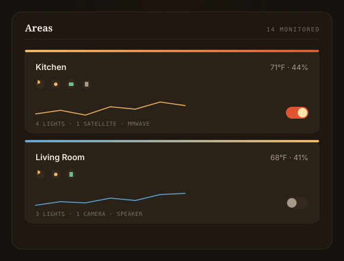
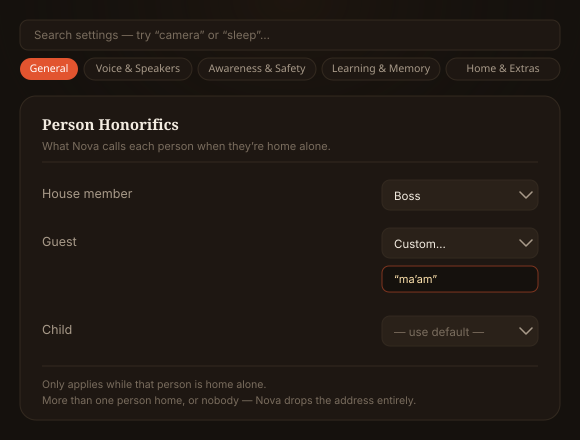

# Nova AI Assistant

A home butler for Home Assistant. You talk to it, it watches over your home, and it learns how you live.

## What Nova is

Nova is a custom integration for Home Assistant. You install it through HACS and it runs inside Home Assistant. There is no extra server, and you don't need a Nova account.

You can talk to Nova by voice or text. Ask it to turn on a light, lock the door or tell you what is open. Ask about your calendar, your solar panels or something on the web. It also keeps an eye on the house in the background. It tells you about a door left open, a leak or someone at the front door, and it suggests automations based on your routines.

You don't need cameras or voice hardware to start. All you need is Home Assistant and an AI to think with: either a cloud key (Groq, Anthropic, OpenAI or Gemini) or a local Ollama server. Cameras, speakers and more can be added whenever you like.

## How Nova behaves

Nova can control your home when you ask. What it won't do on its own is take big steps without you.

- It never installs a suggested automation until you approve it.
- It can't unlock a door, open a garage or disarm the alarm by voice alone. Those need a tap on your phone.
- It tells you what it knows. "The lock is locked" means Nova checked. "I sent the command" means it hasn't confirmed yet.
- If a device name is unclear, it asks which one you mean instead of guessing.
- Smoke, carbon monoxide, water leak and confirmed intrusion alerts can't be muted.

## What you need

- Home Assistant 2024.10.0 or newer, with [HACS](https://hacs.xyz) installed.
- An AI for Nova to use. Pick one: a key from [Groq](https://console.groq.com), Anthropic, OpenAI or Gemini, or the address of a local Ollama server.

Everything else is optional. Cameras are covered in [Camera setup](docs/camera-setup.md). On Home Assistant OS or Supervised, Nova sets up the voice add-ons (Piper, Whisper and openWakeWord) for you. On Container or Core installs you add them yourself.

## Install

1. Add the repository to HACS. Click the button below, or open HACS, choose the three dots, then Custom repositories, and add `https://github.com/abz2much/NOVA` as an Integration.

   

2. Install "Nova AI Assistant" from HACS and restart Home Assistant.
3. Go to Settings, Devices & Services, Add Integration, and choose Nova. Enter a key for each cloud provider you use, your Ollama address, or both. Then pick a provider and model for each job. Nova suggests sensible choices and tests each one. Keys are saved in `secrets.yaml`, not in plain settings.
4. Nova appears in your sidebar. A one time "Nova is ready" notification lists anything that still needs attention.

If you had an older Nova `config.json`, Nova imports it and skips the setup screens.

After every update, refresh the panel with Ctrl+Shift+R (Cmd+Shift+R on a Mac). Your browser caches the dashboard, and the old version can linger.

## Your first five minutes

Open the Nova panel in the sidebar, or talk to Nova through your Assist pipeline. Try:

- "Turn off the lights in the kitchen."
- "What's open in the house?"
- "What's on my calendar tomorrow?"
- "What's the latest news on the Mars mission?"

Nova's settings live in two places. Day to day settings (AI models, cameras, safety, language) are in the Nova panel under Settings. Routing settings such as which phone to notify, quiet hours and credentials are under Settings, Devices & Services, Nova, Configure. [Getting started](docs/getting-started.md) has a tour of the panel.

## What Nova can do

| You want to | What Nova does | Guide |
|---|---|---|
| Talk to your home | Voice and text conversation, with a calm, dry personality you can turn up or down | [Voice and speakers](docs/voice-and-speakers.md) |
| Keep the home safe | Watches for intrusion, smoke, carbon monoxide, leaks, freezing pipes, and doors or windows left open. Can lock up at night | [Safety and security](docs/safety-and-security.md) |
| Know who comes to the door | Analyses doorbell presses, spots packages and mail, and learns regular visitors. Can recognise faces through Frigate or Double Take | [Cameras and faces](docs/cameras-and-faces.md) |
| Stop being nagged at the wrong time | Knows who is home, who is asleep and when quiet hours are, and speaks to the right person in the right room | [Presence and alerts](docs/presence-and-alerts.md) |
| Save effort | Suggests automations from your habits, reminds you when to leave for appointments, and gives morning and evening briefings | [Routines and suggestions](docs/routines-and-suggestions.md) |
| Understand your energy | Shows solar, battery and grid in one place, today's totals and a 36 hour outlook with advice | [Energy](docs/energy.md) |
| Remember things | Keeps facts you tell it, answers from your manuals and receipts, and can read your email (read only) | [Memory and knowledge](docs/memory-and-knowledge.md) |
| Know who is speaking | Recognises voices so it can answer the right person | [Voice recognition](docs/voice-recognition.md) |
| Hear about bad weather | Weather warnings from Met Éireann, the US National Weather Service or a CAP feed | [Weather warnings](docs/weather-warnings.md) |
| Find out why something broke | Checks your setup for problems and explains what it found, with fixes you apply yourself | [Getting started](docs/getting-started.md#when-something-is-not-working) |

Nova also shows its reasoning. The Logs tab lists every decision it made, why, and how confident it was. You can tell it when a decision was helpful or unnecessary.

<table border="0">
<tr>
<td width="50%"></td>
<td width="50%"></td>
</tr>
<tr>
<td align="center"><em>Every room, with live icons, trends and a light switch.</em></td>
<td align="center"><em>Settings are grouped by what you want to do.</em></td>
</tr>
</table>

## Choosing an AI

You can use a cloud AI, a local one, or both. Each of Nova's jobs (conversation, reasoning, camera analysis and so on) can use a different one.

- **Cloud** (Groq, Anthropic, OpenAI, Gemini) is the easiest start. Your requests go to that provider, and you pay their normal usage rates.
- **Local** (Ollama) keeps everything on your own network and costs nothing per request, but needs a computer with a decent graphics card.
- **Offline** is covered too. If the internet drops, Nova keeps handling routine events and simple commands such as "turn on the lamp" or "lock the door" on its own.

You can change providers any time under Settings, AI Models. See [Getting started](docs/getting-started.md).

## Privacy

Everything Nova learns and stores stays in your Home Assistant, mostly in the `nova/` folder of your config directory. Nova has no cloud service and no telemetry. It never sends anything on its own.

Data leaves your network only when you turn on a feature that needs it:

- The AI provider you chose, for the messages Nova sends it.
- Web research (DuckDuckGo or your own SearXNG), email, weather and hazard feeds, and travel times, if you enable them.
- A text to speech service, if it isn't the local Piper voice.

If you run Ollama and the local Piper voice, nothing leaves your network. Wearable and sleep data are never sent to a cloud AI. Camera images are not kept, apart from confirmed intrusion snapshots, which are stored privately and shown only in your panel. The full list is in [Privacy and your data](docs/privacy.md).

## Languages

Nova follows Home Assistant's language, and you can choose another under Settings, General. The setup dialog is available in 21 languages. The panel is fully translated in 11 (German, Dutch, French, Spanish, Brazilian Portuguese, Swedish, Polish, Russian, Czech, Simplified Chinese and Traditional Chinese). Others show English where a translation is missing. Safety alerts are translated for English, French, German, Spanish, Italian, Dutch and Portuguese. See [Translating Nova](docs/translating.md) if you'd like to help.

## Common questions

**The panel looks old after an update.** Hard refresh with Ctrl+Shift+R.

**Nova doesn't speak.** Check that each room has a speaker assigned under Settings, Room Speakers. Then check Notifications only mode and quiet hours.

**A camera tile is blank.** Nest cameras need an extra step. See [Camera setup](docs/camera-setup.md).

**Nova talks too much.** Lower the banter level, turn on Notifications only, or set quiet hours. Critical safety alerts still speak.

**Nova says nothing about something I expected.** Open Logs, then Decisions. It shows what Nova saw and why it stayed quiet.

**Something isn't working.** Open the Diagnostics tab and run Setup Doctor. It lists problems with a plain fix for each.

**How do I update?** Update through HACS, restart Home Assistant, then hard refresh the panel.

**How do I remove Nova?** Remove the integration under Devices & Services, then remove it in HACS. Your `nova/` folder stays until you delete it.

**Can I change every setting?** Yes. The full list is in [Settings reference](docs/settings-reference.md).

## Guides

- [Getting started](docs/getting-started.md): setup, AI models, where settings live, a tour of the panel
- [Safety and security](docs/safety-and-security.md): intrusion, lockdown, things left open, smoke, leaks and freezing pipes
- [Cameras and faces](docs/cameras-and-faces.md): doorbell, packages and mail, scene memory, faces
- [Camera setup](docs/camera-setup.md): Frigate, Eufy, Nest and go2rtc
- [Weather warnings](docs/weather-warnings.md): Met Éireann, the US National Weather Service or a CAP feed
- [Voice and speakers](docs/voice-and-speakers.md): speakers per room, broadcasts, language, how Nova addresses people
- [Presence and alerts](docs/presence-and-alerts.md): who is home, rooms, sleep, quiet hours, mutes
- [Routines and suggestions](docs/routines-and-suggestions.md): leave alerts, offers, suggested automations, briefings, modes
- [Memory and knowledge](docs/memory-and-knowledge.md): facts, relations, documents, email, web research
- [Voice recognition](docs/voice-recognition.md): knowing who is speaking
- [Energy](docs/energy.md): the Energy tab and the outlook
- [Host health](docs/host-health.md): watching the machine Nova runs on
- [Settings reference](docs/settings-reference.md): every setting
- [Privacy and your data](docs/privacy.md): what is stored and what leaves
- [How Nova works](docs/how-nova-works.md): for developers and the curious
- [Translating Nova](docs/translating.md): help add or fix a language
- [Roadmap](docs/roadmap.md): ideas under consideration

## Project status

Nova is a solo project and changes quickly. Releases can include breaking changes, so read [CHANGELOG.md](CHANGELOG.md) before you update. It is usable today, but it isn't a set and forget integration yet.

Found a bug or have an idea? Issues and pull requests are welcome.

## Credit and licence

Nova includes work originally created by sam3gp8 and is distributed under the [MIT License](LICENSE).
